<h2>TensorFlow-FlexUNet-Image-Segmentation-Real-Time-Brain-Stroke-CT (2025/10/17)</h2>

Toshiyuki Arai 
Software Laboratory antillia.com 
 
This is the first experiment of Image Segmentation for <b>Real-Time-Brain Stroke CT (Hemorrhagic and Ischemic) </b> based on 
our <a href="./src/TensorFlowFlexUNet.py">TensorFlowFlexUNet</a>
 (<b>TensorFlow Flexible UNet Image Segmentation Model for Multiclass</b>)
, and a 512x512 pixels PNG dataset <a href="https://drive.google.com/file/d/1PGEM3zT_4r6_Ja_kSq7Nc9XUdHB6eNMW/view?usp=sharing">
Augmented-Real-Time-Brain-Stroke-CT-ImageMask-Dataset.zip</a> with colorized masks 
(Hemorrhagic:red, Ischemic:green) which was derived by us from 
<a href="https://www.kaggle.com/datasets/programmer3/real-time-stroke-detection-in-mri-ct-pet-images/data">
<b>Real-Time Stroke Detection in MRI, CT, PET Images
</a>
</b>
 
 
<b>Data Augmentation Strategy</b> 
To address the class imbalance (in the number of images/masks) between the Hemorrhagic and Ischemic classes of the original CT 
image dataset, we applied our offline augmentation tools, 
 <a href="https://github.com/sarah-antillia/Image-Distortion-Tool">
Image-Distortion-Tool</a>, and 
<a href="https://github.com/sarah-antillia/Barrel-Image-Distortion-Tool">
Barrel-Image-Distortion-Tool</a>
 to augment the Hemorrhagic subset. 
 

<b>Actual Image Segmentation for Images of 512x512 pixels</b> 
As shown below, the inferred masks predicted by our segmentation model trained on the 
PNG dataset appear similar to the ground truth masks, but they lack precision in certain areas. 
<b>rgb_map (Hemorrhagic:red, Ischemic:green)</b>  
 
<table>
<tr>
<th>Input: image</th>
<th>Mask (ground_truth)</th>
<th>Prediction: inferred_mask</th>
</tr>
<tr>
<td>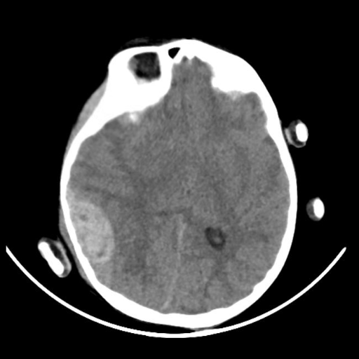</td>
<td></td>
<td></td>
</tr>
</tr>
<td>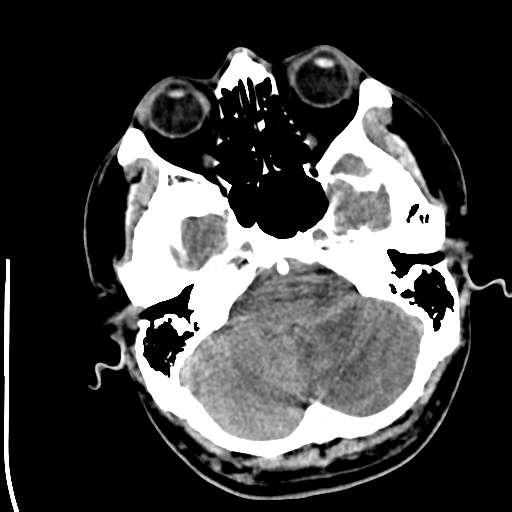</td>
<td></td>
<td>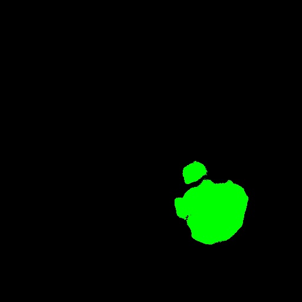</td>
</tr>
<tr>
<td>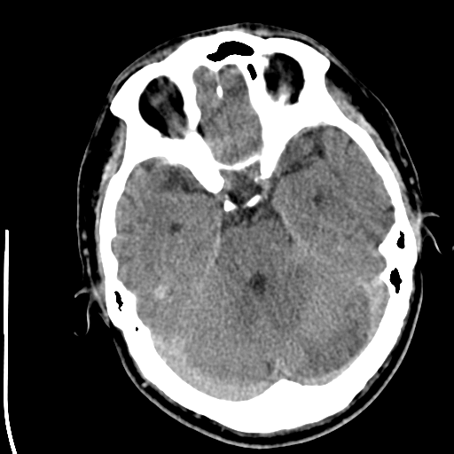</td>
<td>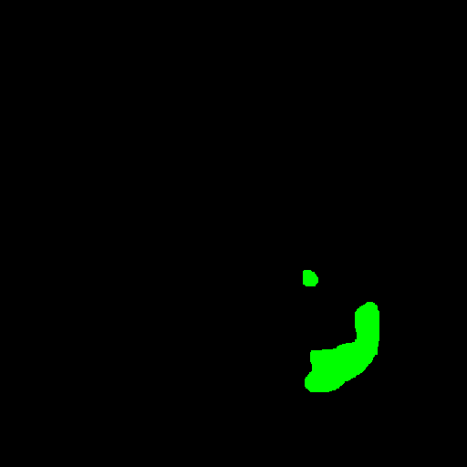</td>
<td>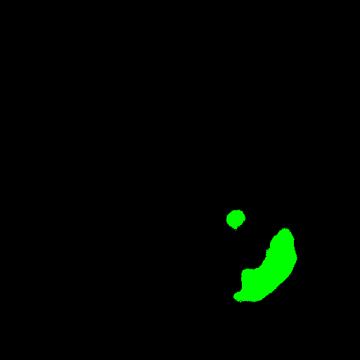</td>
</tr>
</table>

 
<h3>1 Dataset Citation</h3>
The dataset used here was obtained from 
  
<a href="https://www.kaggle.com/datasets/programmer3/real-time-stroke-detection-in-mri-ct-pet-images/data">
<b>Real-Time Stroke Detection in MRI, CT, PET Images
</a>
</b>
 on the kaggle web-site.
 
<h4>About Dataset</h4>
The Multi-Modal Stroke Imaging Dataset is a comprehensive collection of 33.4k medical images from CT, MRI, and PET scans, specifically curated for stroke detection and classification. This dataset is designed to support real-time stroke diagnosis by 
distinguishing between ischemic strokes, hemorrhagic strokes, and normal brain scans.
<h4>LICENSE</h4>
<a href="https://creativecommons.org/publicdomain/zero/1.0/">CC0: Public Domain</a>
 
 
<h3>
2 Real-Time-Brain-Stroke-CT ImageMask Dataset
</h3>
<h3>2.1 ImageMask Dataset</h3>
 If you would like to train this Brain-Stroke-CT Segmentation model by yourself,
 please download our data <a href="https://drive.google.com/file/d/1PGEM3zT_4r6_Ja_kSq7Nc9XUdHB6eNMW/view?usp=sharing">
 Augmented-Real-Time-Brain-Stroke-CT-ImageMask-Dataset.zip
 </a> on the google drive,
, expand the downloaded, and put it under dataset folder to be:
<pre>
./dataset
└─Brain-Stroke-CT
    ├─test
    │   ├─images
    │   └─masks
    ├─train
    │   ├─images
    │   └─masks
    └─valid
        ├─images
        └─masks
</pre>
<b>Brain-Stroke-CT Statistics</b> 
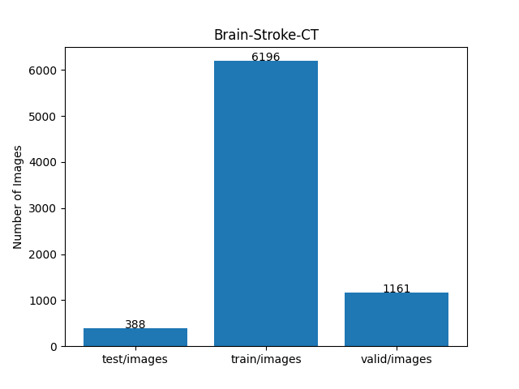 
 
As shown above, the number of images of train and valid datasets is large enough to use for a training set of our segmentation model.
  
<h3>2.2 ImageMask Dataset Generation</h3>
The folder struction of the original <b>NEW-DATASET\REAL-TIME STROKE DETECTION IN MRI, CT, PET IMAGES </b>
folder is the following. 
<pre>
./\NEW-DATASET\REAL-TIME STROKE DETECTION IN MRI, CT, PET IMAGES
├─CT Images
├─MRI Images
└─PET Images
</pre>

For simplicity, we generated our Augmented Brain-Stroke-CT dataset from <b>Training</b> subset of <b>CT Images</b> dataset.. 
<pre>
./NEW-DATASET\REAL-TIME STROKE DETECTION IN MRI, CT, PET IMAGES
 └─CT Images
   └─data
       ├─Testing
...
       └─Training
           ├─Hemorrhagic
           │  ├─images
           │  │  ├─049
           │  │  ├─050
 ...
           │  │  └─130
           │  └─mask
           │      ├─049
           │      ├─050
...
           │      └─124
           └─Ischemic
               ├─images
               │  ├─0019983
               │  ├─0021023
...
               │  └─0539043
               └─mask
                   ├─0019983
                   ├─0021023
 ...
                   └─0539043.
</pre>
 
 
<h3>2.3 Tran Images and Masks Sample </h3>
<b>Train_images_sample</b> 
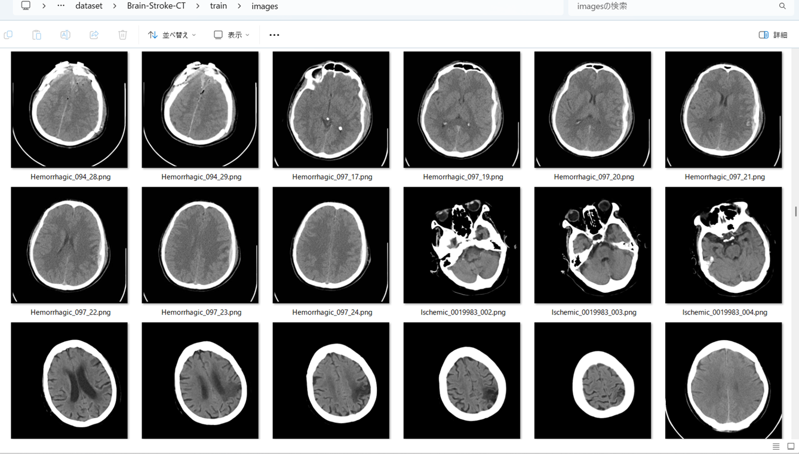
 
<b>Train_masks_sample</b> 
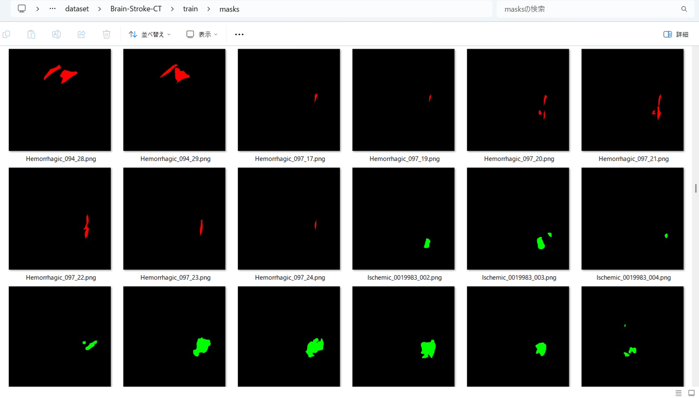
 
 
<h3>
3 Train TensorFlowUNet Model
</h3>
 We have trained Brain-Stroke-CT TensorFlowUNet Model by using the following
<a href="./projects/TensorFlowFlexUNet/Brain-Stroke-CT/train_eval_infer.config"> <b>train_eval_infer.config</b></a> file.  
Please move to ./projects/TensorFlowFlexUNet/Brain-Stroke-CTand, and run the following bat file. 
<pre>
>1.train.bat
</pre>
, which simply runs the following command. 
<pre>
>python ../../../src/TensorFlowFlexUNetTrainer.py ./train_eval_infer.config
</pre>

<b>Model parameters</b> 
Defined a small <b>base_filters = 16</b> and large <b>base_kernels = (9,9)</b> for the first Conv Layer of Encoder Block of 
<a href="./src/TensorFlowUNet.py">TensorFlowUNet.py</a> 
and a large num_layers (including a bridge between Encoder and Decoder Blocks).
<pre>
[model]
image_width    = 512
image_height   = 512
image_channels = 3

num_classes    = 3

base_filters   = 16
base_kernels   = (9,9)
num_layers     = 8
dropout_rate   = 0.05
dilation       = (1,1)

</pre>

<b>Learning rate</b> 
Defined a very small learning rate.  
<pre>
[model]
learning_rate  = 0.00007
</pre>

<b>Online augmentation</b> 
Disabled our online augmentation.  
<pre>
[model]
model         = "TensorFlowFlexUNet"
generator     = False
</pre>

<b>Loss and metrics functions</b> 
Specified "categorical_crossentropy" and <a href="./src/dice_coef_multiclass.py">"dice_coef_multiclass"</a>. 
You may specify other loss and metrics function names. 
<pre>
[model]
loss           = "categorical_crossentropy"
metrics        = ["dice_coef_multiclass"]
</pre>
<b>Learning rate reducer callback</b> 
Enabled learing_rate_reducer callback, and a small reducer_patience.
<pre> 
[train]
learning_rate_reducer = True
reducer_factor     = 0.5
reducer_patience   = 4
</pre>

<b>Early stopping callback</b> 
Enabled early stopping callback with patience parameter.
<pre>
[train]
patience      = 10
</pre>

<b>RGB Color map</b> 
rgb color map dict for Brain-Stroke-CT 1+2 classes.
<pre>
[mask]
mask_datatype    = "categorized"
mask_file_format = ".png"

;Brain-Stroke CT
; rgb color map dict for 3 classes.
;                 Hemorrhagic:red, Ischemic:green
rgb_map = {(0,0,0):0,(255,0,0):1,(0,255,0):2,}

</pre>

<b>Epoch change inference callback</b> 
Enabled <a href="./src/EpochChangeInferencer.py">epoch_change_infer callback (EpochChangeInferencer.py)</a></b>. 
<pre>
[train]
epoch_change_infer       = True
epoch_change_infer_dir   =  "./epoch_change_infer"
num_infer_images         = 6
</pre>

By using this callback, on every epoch_change, the inference procedure can be called
 for 6 images in <b>mini_test</b> folder. This will help you confirm how the predicted mask changes 
 at each epoch during your training process.    

<b>Epoch_change_inference output at starting (epoch 1,2,3)</b> 
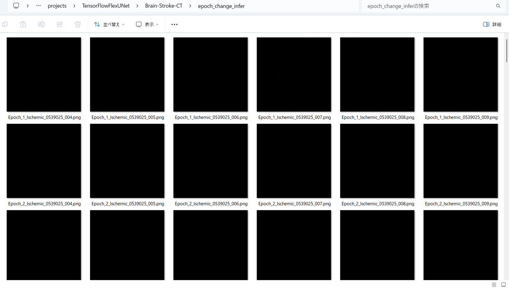 
 
<b>Epoch_change_inference output at middlepoint (epoch 22,23,24)</b> 
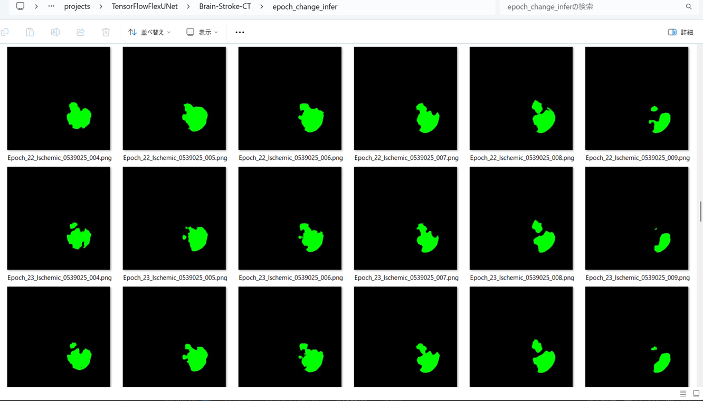 
 

<b>Epoch_change_inference output at ending (epoch 44,45,46)</b> 
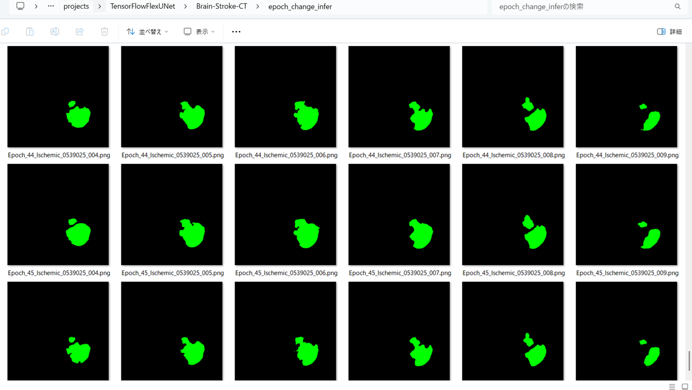 
 

In this experiment, the training process was stopped at epoch 46 by EarlyStopping Callback.  
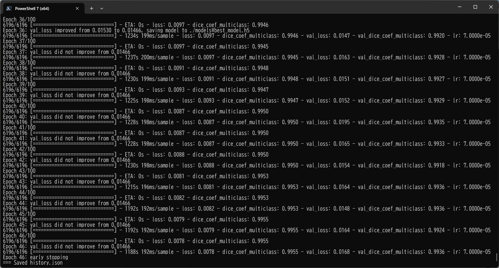 
 

<a href="./projects/TensorFlowFlexUNet/Brain-Stroke-CT/eval/train_metrics.csv">train_metrics.csv</a> 
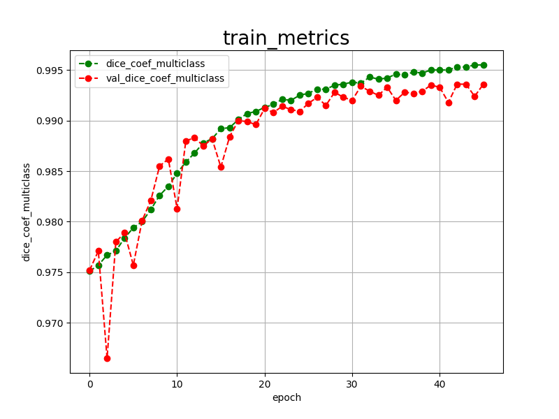 

 
<a href="./projects/TensorFlowFlexUNet/Brain-Stroke-CT/eval/train_losses.csv">train_losses.csv</a> 
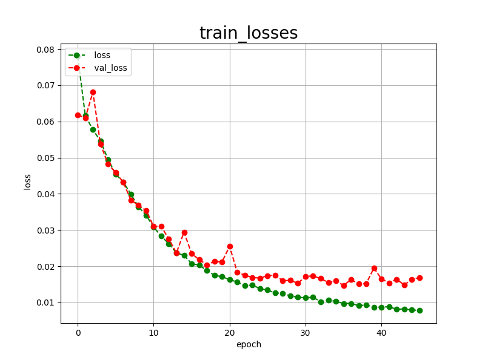 

 

<h3>
4 Evaluation
</h3>
Please move to a <b>./projects/TensorFlowFlexUNet/Brain-Stroke-CT</b> folder, 
and run the following bat file to evaluate TensorFlowUNet model for Brain-Stroke-CT. 
<pre>
./2.evaluate.bat
</pre>
This bat file simply runs the following command.
<pre>
python ../../../src/TensorFlowFlexUNetEvaluator.py ./train_eval_infer.config
</pre>

Evaluation console output: 
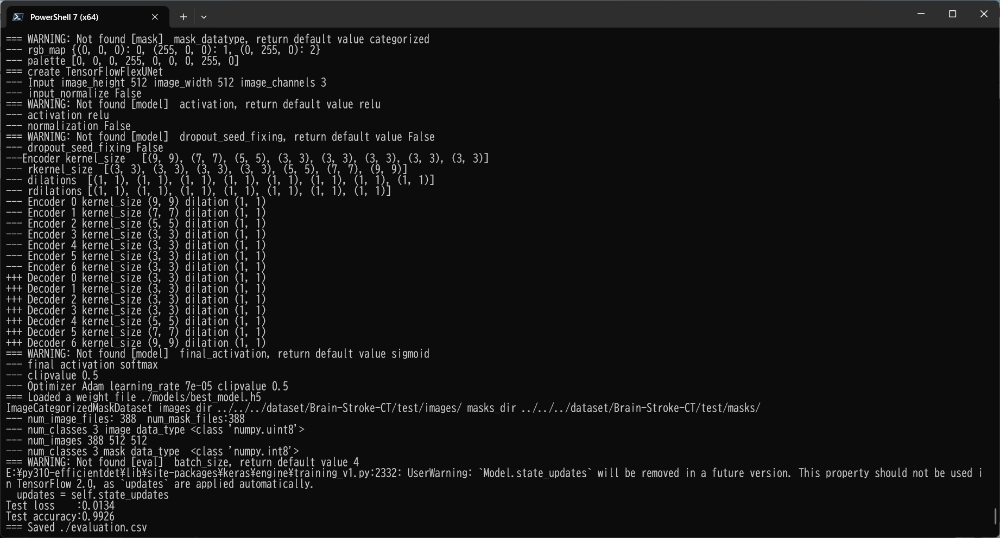
  Image-Segmentation-Brain-Stroke-CT

<a href="./projects/TensorFlowFlexUNet/Brain-Stroke-CT/evaluation.csv">evaluation.csv</a> 

The loss (bce_dice_loss) to this Brain-Stroke-CT/test was low, and dice_coef high as shown below.
 
<pre>
categorical_crossentropy,0.0134
dice_coef_multiclass,0.9926
</pre>
 
<h3>
5 Inference
</h3>
Please move to a <b>./projects/TensorFlowFlexUNet/Brain-Stroke-CT</b> folder 
,and run the following bat file to infer segmentation regions for images by the Trained-TensorFlowUNet model for Brain-Stroke-CT. 
<pre>
./3.infer.bat
</pre>
This simply runs the following command.
<pre>
python ../../../src/TensorFlowFlexUNetInferencer.py ./train_eval_infer.config
</pre>

<b>mini_test_images</b> 
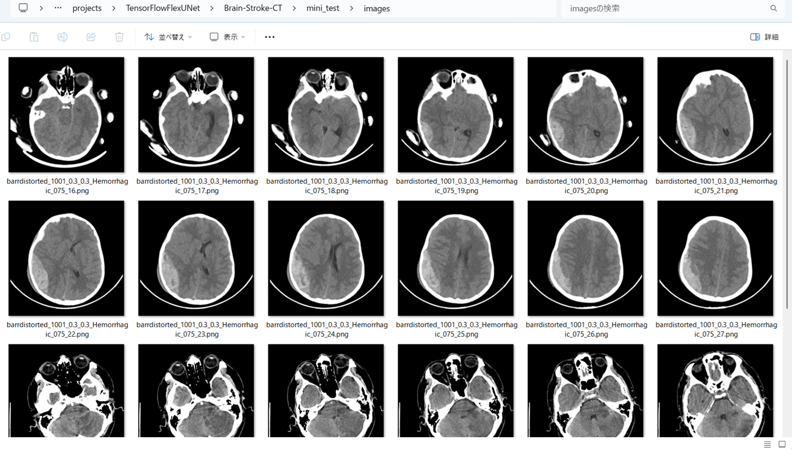 
<b>mini_test_mask(ground_truth)</b> 
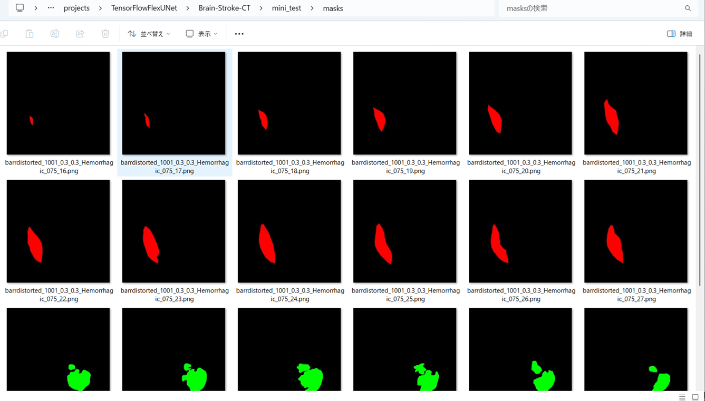 

<b>Inferred test masks</b> 
 
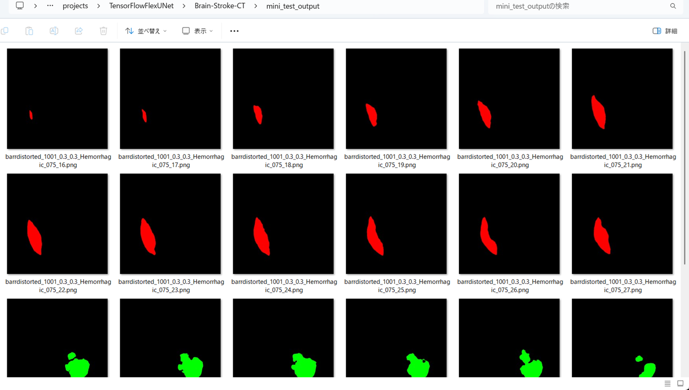 
 

<b>Enlarged images and masks for Images of 512x512 pixels </b> 
As shown below, this segmentation model failed to detect some Bleeding and Ischemia lesions. 

<b>rgb_map (Hemorrhagic:red, Ischemic:green)</b>  

<table>
<tr>

<th>Image</th>
<th>Mask (ground_truth)</th>
<th>Inferred-mask</th>
</tr>

<td>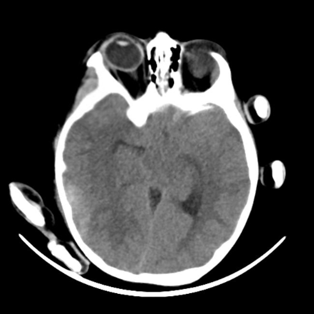</td>
<td></td>
<td></td>
</tr>
<tr>
<td>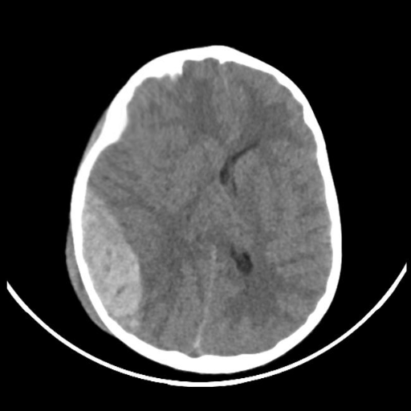</td>
<td></td>
<td></td>
</tr>
<tr>
<td>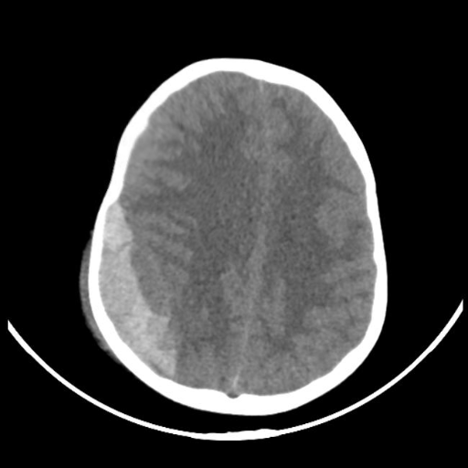</td>
<td></td>
<td></td>
</tr>
<tr>
<td>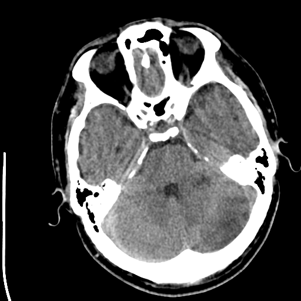</td>
<td>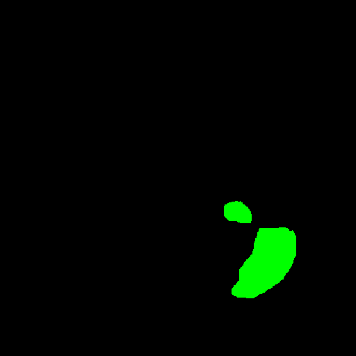</td>
<td>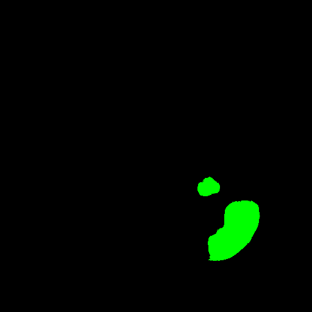</td>
</tr>
<tr>
<td></td>
<td></td>
<td></td>
</tr>
<tr>
<td>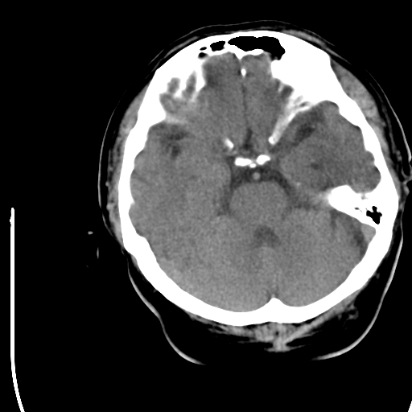</td>
<td></td>
<td></td>
</tr>

</table>

 

<h3>
References
</h3>
<b>1. Artificial Intelligence in Healthcare Competition (TEKNOFEST-2021):Stroke Data Set</b> 
Ural Koç,, Ebru Akçapınar Sezer, Yaşar Alper Özkaya, Yasin Yarbay4 , Onur Taydaş, 
Veysel Atilla Ayyıldız , Hüseyin Alper Kızıloğlu, Uğur Kesimal, İmran Çankaya, Muhammed Said Beşler, 
Emrah Karakaş, Fatih Karademir, Nihat Barış Sebik, Murat Bahadır , Özgür Sezer, 
Batuhan Yeşilyurt, Songul Varlı, Erhan Akdoğan, Mustafa Mahir Ülgü , Şuayip Birinci 

<a href="https://www.eajm.org/en/artificial-intelligence-in-healthcare-competition-teknofest-2021-stroke-data-set-1618971">
https://www.eajm.org/en/artificial-intelligence-in-healthcare-competition-teknofest-2021-stroke-data-set-1618971
</a>

  
<b>2. Hemorrhagic stroke lesion segmentation using a 3D U-Net with squeeze-and-excitation blocks</b> 
Valeriia Abramova, Albert Clèrigues, Ana Quiles, Deysi Garcia Figueredo, Yolanda Silva, Salvador Pedraza, 
 Arnau Oliver, Xavier Lladó 
<a href="https://www.sciencedirect.com/science/article/pii/S0895611121000574">
https://www.sciencedirect.com/science/article/pii/S0895611121000574
</a>
 
 
<b>3. Segmentation of acute stroke infarct core using image-level labels on CT-angiography</b> 
Luca Giancardo, Arash Niktabe, Laura Ocasio, Rania Abdelkhaleq, Sergio Salazar-Marioni, Sunil A Sheth 
<a href="https://pmc.ncbi.nlm.nih.gov/articles/PMC10011814/">
https://pmc.ncbi.nlm.nih.gov/articles/PMC10011814/
</a>
 
 
<b>4.Segmenting Small Stroke Lesions with Novel Labeling Strategies</b> 
Liang Shang, Zhengyang Lou, Andrew L. Alexander, Vivek Prabhakaran, 
William A. Sethares, Veena A. Nair, and Nagesh Adluru 
<a href="https://arxiv.org/pdf/2408.02929">
https://arxiv.org/pdf/2408.02929
</a>
 
 
<b>5. TensorFlow-FlexUNet-Image-Segmentation-Brain-Stroke-CT</b> 
Toshiyuki Arai antillia.com 
<a href="https://github.com/sarah-antillia/TensorFlow-FlexUNet-Image-Segmentation-Brain-Stroke-CT">
TensorFlow-FlexUNet-Image-Segmentation-Brain-Stroke-CT</a>
 
 
<b>6.TensorFlow-FlexUNet-Image-Segmentation-TEKNOFEST-2021-Stroke-CT</b> 
Toshiyuki Arai antillia.com 
<a href="https://github.com/sarah-antillia/TensorFlow-FlexUNet-Image-Segmentation-TEKNOFEST-2021-Stroke-CT">
https://github.com/sarah-antillia/TensorFlow-FlexUNet-Image-Segmentation-TEKNOFEST-2021-Stroke-CT
</a>

